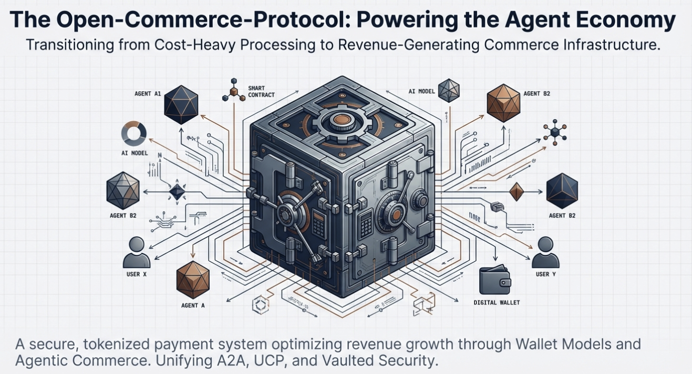

An Implementation Proposal for the Open Wallet System

1.0 The Strategic Imperative: Migrating from Traditional Payments to a Tokenized Wallet

The escalating costs of traditional payment processing, often a standard 2.9% + $0.30 per transaction, represent a significant and growing inhibitor to profitability and business growth. These fees erode margins on every sale, making certain business models, such as micro-transactions, entirely unviable. This section establishes the core business case for adopting a tokenized wallet infrastructure, a strategic shift designed to reclaim lost revenue, enhance customer relationships, and create new income streams.

The Open Wallet system is an open-source, tokenized infrastructure designed to fundamentally transform payment handling. By enabling businesses to create pre-funded user wallets, it bypasses the high costs of per-transaction processing, maximizes revenue, and ensures robust PCI DSS compliance. This model shifts the fee structure from a recurring operational expense on every customer action to a one-time fee applied only during wallet deposits, unlocking substantial financial and strategic advantages.

The fundamental difference between the "Traditional Model" and the "Wallet Model" is stark. The following comparison, based on a scenario of 1,000 transactions at $10 each, quantifies the dramatic cost savings and margin improvement.

Feature	Traditional Model (Card-on-File)	Wallet Model (Pre-funded)
Total Revenue	$10,000	$10,000
Transactions	1,000 transactions @ $10	1,000 transactions from wallet balance
Fee Basis	Fees on every transaction	Fees only on deposits (e.g., 100 deposits @ $100)
Processing Fees	$590 (1,000 * ($10 * 2.9% + $0.30))	$320 (100 * ($100 * 2.9% + $0.30))
Net Revenue	$9,410	$9,680
Financial Outcome	Standard operational cost	45.7% reduction in processing fees

This architectural shift delivers a cascade of key business benefits that extend far beyond simple cost reduction:

* Lower Payment Processing Costs As demonstrated in the comparison above, processing payments from pre-funded wallet balances can reduce overall payment processing expenses significantly, as fees are paid only when users make a deposit, not on every subsequent transaction. This can reduce overall payment processing expenses by as much as 90%.
* Improved Cash Flow Pre-funded wallets provide a predictable stream of working capital. Funds are collected upfront, improving the business's cash position and reducing reliance on the fluctuating timelines of traditional payment settlements.
* Higher Customer Lifetime Value Wallet users demonstrate significantly higher engagement, interacting with the platform 3-5x more frequently than non-wallet users. This increased activity directly translates to higher lifetime value and deeper brand loyalty.
* Reduced Churn Stored value in a wallet creates a natural switching cost. Customers with an existing balance are less likely to churn, as it requires them to abandon their funds, thereby increasing retention rates.
* Faster Checkout One-click payments from a wallet balance eliminate the friction of entering card details for every purchase. This streamlined experience is proven to increase conversion rates by 20-30%, reducing cart abandonment and capturing more revenue.
* Float Income Generation The aggregated balances held across all user wallets create a cash reserve, or "float." This capital can be held in an interest-bearing account, generating a new, passive income stream for the business.
* Promotional Flexibility A wallet system provides a powerful and cost-effective platform for executing marketing strategies. Businesses can instantly issue deposit bonuses, loyalty rewards, and other incentives directly into user accounts without incurring additional processing fees.

By transitioning from a high-friction, high-cost payment model to a streamlined wallet infrastructure, a business can not only protect its margins but also unlock powerful new strategies for growth. The following section provides a detailed exploration of these specific revenue-generating opportunities.

2.0 A Deep Dive into Revenue Optimization Strategies

Moving beyond simple cost reduction, the Open Wallet system unlocks multiple, distinct streams for revenue optimization and customer retention. It transforms the payment function from a cost center into a strategic asset for growth. This section deconstructs ten specific strategies and analyzes their quantifiable business impact, illustrating how a tokenized wallet can fundamentally reshape a company's financial performance and competitive positioning.

Eliminate Per-Transaction Fees

* The Problem: Traditional payment processors levy a fee (e.g., 2.9% + $0.30) on every single transaction, which can consume 5-10% of total revenue, particularly for businesses with small average ticket sizes.
* The Open Wallet Solution: With Open Wallet, the processing fee is charged only when users deposit funds. All subsequent transactions from the wallet balance are internal ledger movements with zero processing cost, reducing overall payment expenses by 70-90%.
* Real-World Impact: For a ride-sharing platform with 10,000 daily rides at an average fare of $8.50, the annual savings are staggering.
  * Traditional Fees: $2,465/day
  * Wallet Fees: $255/day
  * Annual Savings: $806,650

Increase Average Transaction Value

* The Opportunity: The psychology of spending from a pre-loaded balance is fundamentally different. Users exhibit lower price sensitivity and a higher propensity for impulse purchases, leading to a 30-40% higher transaction frequency and a 25% higher average order value (AOV).
* The Open Wallet Solution: Implement strategies like deposit bonuses (e.g., "Add $50, get $5 free"), tiered rewards for larger deposits, and auto-reload functionality to encourage users to maintain higher balances and spend more freely.
* Real-World Impact: A platform can directly influence spending habits, turning a simple payment method into a tool for increasing revenue per customer.

Capture Stranded Revenue

* The Problem: Traditional systems lose an estimated 5-15% of revenue to declined cards due to expirations, insufficient funds, or fraud alerts. This "involuntary churn" is a silent revenue killer, especially for subscription models.
* The Open Wallet Solution: The wallet acts as a buffer. Even if a user's underlying card is declined, their service continues uninterrupted as long as their wallet has a balance. The system can be configured to automatically top-up the balance when it falls below a set threshold, virtually eliminating failed payments.
* Real-World Impact: This strategy reduces involuntary churn by 60-80%, preserving valuable customer relationships and ensuring revenue continuity.

// Automatically reload wallet before balance depletes
{
  "autoTopUp": {
    "enabled": true,
    "threshold": 10,  // Reload when balance < $10
    "amount": 50      // Add $50 each time
  }
}

Enable Profitable Micro-transactions

* The Problem: A $1.00 transaction in a traditional model can incur a $0.33 fee, representing a 33% cost that makes micro-transactions unprofitable.
* The Open Wallet Solution: A $1.00 transaction processed from a wallet balance has a 0% transaction cost, making it 100% profitable. This opens the door to new business models.
* Real-World Impact: Businesses can profitably implement use cases like content paywalls (0.25 articles), in-game virtual goods (0.99 items), micro-tipping, donations, and pay-per-use API calls.

Generate Float Income

* The Opportunity: The aggregate of all customer wallet balances creates a significant cash reserve (the "float") that can be leveraged.
* The Open Wallet Solution: By placing these aggregated funds in an interest-bearing account, a business can generate passive income.
* Real-World Impact: A platform with 50,000 users holding an average balance of $25 creates a total float of 1,250,000. At a 4% APY, this generates **50,000 in annual float income**. (Compliance Note: Proper licensing and segregation of customer funds must be ensured in accordance with local regulations.)

Reduce Fraud and Chargebacks

* The Problem: Chargebacks are costly, not just in lost revenue but also in administrative fees (15-100 per incident) and potential penalties from payment processors.
* The Open Wallet Solution: Pre-funded accounts virtually eliminate the risk of chargebacks on wallet-based transactions. Since the funds are already secured, the primary vector for friendly fraud is closed, reducing fraud-related losses by 80-95%.
* Real-World Impact: An e-commerce business with a 1% chargeback rate on $1M in monthly revenue can reduce its chargeback-related costs from $25,000/month to just 1,250/month, resulting in **23,750 in monthly savings**.

Optimize Conversion Rates

* The Problem: A lengthy or complex checkout process is a primary driver of cart abandonment. Requiring users to repeatedly enter payment information creates significant friction.
* The Open Wallet Solution: A one-click payment flow using the wallet balance dramatically reduces friction. This mobile-optimized experience is proven to boost key metrics across the board.
* Real-World Impact: Industry A/B tests show that wallet systems can increase checkout completion by 31% (from 68% to 89%) and average session value by 30%, leading to an overall 70% revenue lift.

Implement Targeted Promotions

* The Opportunity: A direct, low-cost channel to incentivize customer behavior.
* The Open Wallet Solution: The system enables the creation of dynamic, targeted promotions with zero processing overhead. Businesses can offer instant bonuses on deposits, loyalty rewards, referral incentives, and wallet-exclusive pricing.
* Real-World Impact: A holiday promotion can be configured to automatically add a 10% bonus for deposits over $50, directly encouraging larger top-ups and driving immediate revenue.

{
  "promotion": "holiday2024",
  "bonus": {
    "type": "percentage",
    "value": 10,
    "minDeposit": 50,
    "maxBonus": 25
  },
  "result": "Deposit $100, receive $110 in wallet"
}

Streamline Marketplace Economics

* The Problem: In two-sided marketplaces, traditional payment models introduce delays (5-7 days for bank transfers) and high fees that cut into the earnings of sellers or contractors.
* The Open Wallet Solution: The platform can facilitate instant, fee-free wallet-to-wallet transfers between participants. This eliminates hold periods and dramatically reduces costs for both the platform and its users.
* Real-World Impact: On a freelance platform, the wallet model allows a contractor to receive their payment instantly and earn 3.4% more on a $100 job, while the platform simultaneously saves on processing costs.

Build Customer Lock-In

* The Opportunity: Transforming a transactional relationship into a long-term, loyal one.
* The Open Wallet Solution: Unredeemed balances create a powerful switching cost. Combined with auto-reload features that build behavioral habits and wallet-exclusive perks, the system fosters deep customer retention.
* Real-World Impact: Industry benchmarks show that wallet users have a 72% 90-day retention rate compared to just 35% for non-wallet users. This translates directly to a 236% increase in customer lifetime value, from $247 to $831.

These strategies collectively demonstrate that the Open Wallet system is more than a payment utility; it is a comprehensive platform for optimizing revenue, enhancing user engagement, and building a more resilient and profitable business. The next section will examine the specific features and capabilities that power these outcomes.

3.0 System Features and Core Capabilities

A robust and versatile feature set is essential for serving the diverse needs of all stakeholders, from end-users making payments to administrators managing operations and developers building integrations. The Open Wallet system is architected with a comprehensive suite of functionalities designed to provide security, flexibility, and a seamless user experience. This section categorizes and details the core capabilities that underpin the platform.

Core Wallet Functionality

These are the foundational features that ensure secure and reliable wallet operations.

* Secure Tokenization: Employs PCI DSS compliant payment tokenization, ensuring that no raw card data is ever stored on the system.
* Multi-Currency Support: Capable of handling transactions in multiple currencies with built-in support for automatic conversion.
* Transaction Management: Provides a complete transaction lifecycle, tracking payments through pending, completed, and failed states for full accountability.
* Balance Management: Guarantees real-time, accurate balance tracking using atomic operations to prevent inconsistencies and race conditions.
* Audit Trail: Maintains a comprehensive and immutable history of all transactions and wallet activities for logging, support, and compliance purposes.

Mobile Payment Integrations

The system is designed for a mobile-first world, with native integrations for the most popular payment platforms.

* Apple Pay Integration: Offers native support for seamless and secure payments within iOS applications.
* Google Pay Integration: Provides native support for one-click payments within Android applications.
* Token Vault: Includes a secure, encrypted vault for storing payment tokens, ensuring sensitive information is protected at rest.
* Biometric Authentication: Supports modern security standards, including Touch ID, Face ID, and fingerprint authentication, for enhanced user security.

Administrative and Management Tools

A powerful suite of back-office tools enables efficient business operations and oversight.

* Dashboard Analytics: Delivers real-time statistics on wallet activity, transaction metrics, total balances, and user engagement.
* Refund Processing: Features a complete, streamlined workflow for handling refunds, including an approval system to maintain financial controls.
* Customer Management: Provides tools for customer support teams to manage wallet status, view transaction histories, and resolve issues.
* Transaction Monitoring: Offers advanced filtering, search, and data export capabilities for in-depth analysis and reporting.
* Role-Based Access Control: Allows for the creation of granular permissions for administrative users, ensuring that team members only have access to the functions relevant to their roles.

Developer Experience Enhancements

The platform is built to be developer-friendly, accelerating integration and reducing time-to-market.

* RESTful API: A well-documented, intuitive REST API provides comprehensive access to all system functionalities.
* Webhook Support: Delivers real-time notifications for critical transaction events, enabling reactive and event-driven architectures.
* SDK Examples: Includes practical examples in JavaScript, Python, and cURL to help developers get started quickly.
* Test Mode: Offers a complete sandbox environment with mock data for thorough testing and validation before going live.
* TypeScript Support: Provides full TypeScript definitions for the core libraries and UI kit, ensuring type safety and improving developer productivity.

These features provide the foundation for a secure, scalable, and user-friendly payment ecosystem. The next section will detail the underlying technical architecture that supports these capabilities.

4.0 Technical Architecture and Implementation Pathway

A sound, scalable architecture is critical for ensuring the reliability, security, and future growth of any payment platform. The Open Wallet system is built on a modern, modular design that promotes maintainability and simplifies deployment. This section provides a clear overview of the system's architecture, its key components, and the straightforward steps required for implementation and configuration.

System Architecture

Open Wallet follows a modular, service-oriented architecture designed for separation of concerns and independent scalability. Communication between layers is secured via HTTPS/TLS, with an API Gateway handling primary concerns like authentication and rate limiting before requests are routed to the appropriate backend service.

Key Components

The architecture is composed of five distinct services, each with a dedicated responsibility:

1. Wallet Service: Manages the core business logic for all wallet operations, including creation, balance updates, and status changes.
2. Payment Service: Handles the integration with mobile payment processors like Apple Pay and Google Pay, as well as the initial tokenization of payment methods.
3. Token Service: Manages the secure storage, retrieval, and lifecycle of payment tokens within the encrypted vault.
4. Transaction Service: Oversees the complete lifecycle of a transaction, from initiation to completion or failure, ensuring data integrity.
5. Admin Service: Powers the administrative dashboard, providing endpoints for reporting, customer management, and other operational tasks.

Implementation and Configuration

Deploying the Open Wallet system is a streamlined process. The following details the prerequisites and steps for a basic setup.

Prerequisites:

* Node.js 18+ or Python 3.9+
* MongoDB 6.0+ or PostgreSQL 14+
* An account with a compatible tokenization provider (e.g., Basis Theory)
* Redis (Optional, for caching)

Basic Setup:

# Clone the repository
git clone https://github.com/ThomasC3/open-wallet.git
cd open-wallet

# Install dependencies
npm install

# Configure environment
cp .env.example .env
# Edit .env with your configuration

# Run database migrations
npm run migrate

# Start the server
npm start

Installation Methods:

* Using npm: npm install @open-wallet/core
* Using yarn: yarn add @open-wallet/core
* Using Docker: docker pull open-wallet/api:latest
* From Source: Clone the repository and run npm install followed by npm start.

Configuration can be managed through environment variables or dedicated configuration files.

Environment Variables: Key variables include server settings, database connection URLs, tokenization provider API keys, and security secrets.

* NODE_ENV
* PORT
* DATABASE_URL
* TOKENIZATION_API_KEY
* JWT_SECRET
* ENCRYPTION_KEY
* APPLE_PAY_MERCHANT_ID
* GOOGLE_PAY_MERCHANT_ID

Configuration File (config/default.json): For more complex configurations, a JSON file allows for detailed control over wallet rules, transaction parameters, and security settings like rate limiting.

{
  "server": {
    "port": 3000,
    "host": "0.0.0.0"
  },
  "wallet": {
    "defaultCurrency": "USD",
    "minBalance": 0,
    "maxBalance": 10000,
    "autoTopUp": {
      "enabled": true,
      "threshold": 10,
      "amount": 50
    }
  },
  "transactions": {
    "maxRetries": 3,
    "timeoutMs": 30000,
    "idempotencyWindowHours": 24
  },
  "security": {
    "rateLimit": {
      "windowMs": 900000,
      "max": 100
    }
  }
}

This clear architecture and straightforward deployment process enable rapid implementation. The following section focuses on the critical aspects of security, compliance, and final mobile integration.

5.0 Security, Compliance, and Mobile Integration

In any system that handles payments, security and compliance are non-negotiable foundations. A breach of trust can have catastrophic consequences for both a business and its customers. The Open Wallet system is architected from the ground up with a security-first mindset, designed to meet stringent PCI DSS compliance standards and provide a robust framework for protecting sensitive data. This section details the system's approach to security, its compliance features, and provides concrete examples of mobile SDK integration.

PCI DSS Compliance and Security Framework

Open Wallet is designed to help businesses maintain PCI DSS compliance by architecturally removing raw card data from their environment. By leveraging a third-party tokenization provider, the system never stores, processes, or transmits sensitive cardholder information.

Core Compliance Features The following features are central to its compliance and security posture:

* Encrypted Storage: All sensitive data, including payment tokens and user information, is encrypted at rest using strong algorithms like AES-256-GCM.
* TLS Required: All API communication is enforced over HTTPS/TLS 1.3, ensuring that data is encrypted and secure while in transit.
* Token Vault: Payment tokens are stored in a secure, isolated vault with strict access controls, preventing unauthorized access.
* Audit Logging: A complete and immutable audit trail is maintained for all operations, providing full traceability for security reviews and forensic analysis.

Recommended Best Practices To maintain a secure environment, the following operational practices are recommended:

1. Use Environment Variables: Never commit secrets such as API keys, database URLs, or encryption keys to version control.
2. Rotate Keys Regularly: Implement a policy for regularly rotating all encryption keys and security credentials to limit the window of exposure.
3. Enable Rate Limiting: Configure and enable rate limiting to protect the API against brute-force attacks, abuse, and potential DDoS vectors.
4. Monitor Suspicious Activity: Set up alerts and monitoring for unusual transaction patterns or access attempts to detect and respond to threats proactively.
5. Regular Security Audits: Conduct periodic security reviews and vulnerability assessments of the deployed environment.

Token Security Measures The security of payment tokens is paramount. The system ensures their protection through a multi-layered approach:

* Encryption at Rest: All tokens are encrypted using industry-standard AES-256-GCM before being stored in the database.
* Access Controls: Strict, role-based access controls ensure that only authorized services and administrators can access or manage tokens.
* Expiration: Tokens can be configured with an automatic expiration period to limit their lifespan and reduce risk.
* Audit Trail: All access to and use of tokens is meticulously logged to provide a complete history of their lifecycle.

Mobile Integration Examples

Integrating the Open Wallet system into mobile applications is streamlined with dedicated SDKs and clear examples.

iOS (Swift) Integration Example

import OpenWallet

// Initialize the SDK
let wallet = OpenWallet(apiKey: "your_api_key", baseURL: "https://api.yourapp.com")

// Create Apple Pay payment request
let paymentRequest = PKPaymentRequest()
paymentRequest.merchantIdentifier = "merchant.com.yourapp"
paymentRequest.supportedNetworks = [.visa, .masterCard, .amex]
paymentRequest.merchantCapabilities = .capability3DS
paymentRequest.countryCode = "US"
paymentRequest.currencyCode = "USD"

// Process payment
wallet.processApplePayPayment(walletId: "wallet-456", paymentData: payment.token.paymentData) { result in
  switch result {
    case .success(let transaction):
      print("Payment successful: \(transaction.id)")
    case .failure(let error):
      print("Payment failed: \(error)")
  }
}

Android (Kotlin) Integration Example

import com.openwallet.sdk.OpenWallet
import com.openwallet.sdk.GooglePayConfig

// Initialize the SDK
val wallet = OpenWallet(apiKey = "your_api_key", baseUrl = "https://api.yourapp.com")

// Configure Google Pay
val googlePayConfig = GooglePayConfig(
  environment = WalletConstants.ENVIRONMENT_PRODUCTION,
  merchantId = "your_google_merchant_id",
  merchantName = "Your App"
)

// Process payment
wallet.processGooglePayPayment(walletId = "wallet-456", paymentData = paymentData) { result ->
  when (result) {
    is Result.Success -> { println("Payment successful: ${result.data.transactionId}") }
    is Result.Error -> { println("Payment failed: ${result.error}") }
  }
}

React Native Integration Example

import OpenWallet from ' @open-wallet/react-native';

// Initialize
const wallet = new OpenWallet({
  apiKey: 'your_api_key',
  baseURL: 'https://api.yourapp.com'
});

// Add funds using Apple Pay
const addFunds = async () => {
  try {
    const result = await wallet.addFundsWithApplePay({
      walletId: 'wallet-456',
      amount: 50.00,
      merchantId: 'merchant.com.yourapp'
    });
    console.log('Funds added:', result.transactionId);
  } catch (error) {
    console.error('Payment failed:', error);
  }
};

This robust security posture and straightforward mobile integration ensure a trusted and efficient implementation. The final section will detail the tools available to developers to further accelerate this process.

6.0 Developer Experience: UI Kit and API Documentation

A superior developer experience is crucial for accelerating time-to-market, reducing implementation costs, and fostering innovation. The Open Wallet system is equipped with a suite of tools designed to empower developers, including a production-ready UI Kit and a comprehensive, well-documented RESTful API. These resources enable development teams to build, test, and deploy a full-featured wallet experience efficiently.

Production-Ready UI Kit

Open Wallet includes a complete UI Kit to help teams build a beautiful, branded wallet experience in minutes. It provides a library of pre-built, customizable React components that handle the most common interface requirements, allowing developers to focus on unique business logic rather than re-inventing core UI elements.

UI Kit Features:

* Pre-built Components: Over 20 production-ready React components covering everything from balance displays to transaction lists.
* Fully Themeable: A complete design token system allows for deep customization of colors, typography, and styles to match any brand identity.
* Responsive Design: Components are built with a mobile-first approach to ensure a seamless experience on any device.
* Accessible: Designed to be WCAG 2.1 AA compliant, ensuring the interface is usable by everyone.
* TypeScript Support: Full type definitions are included for a more robust and error-free development process.
* Framework Agnostic: Can be used with standard React, React Native, or frameworks like Next.js.

Quick UI Kit Example: The following snippet demonstrates how easily a complete, themed wallet dashboard can be rendered.

import { WalletProvider, WalletDashboard } from ' @open-wallet/ui-kit';

function App() {
  return (
    <WalletProvider
      theme={{
        colors: {
          primary: '#007AFF',
          gradient: 'linear-gradient(135deg, #667eea 0%, #764ba2 100%)'
        },
        brandName: 'Your Brand'
      }}
    >
      <WalletDashboard />
    </WalletProvider>
  );
}

Available Components:

* Layout Components: WalletDashboard, WalletCard, TransactionList
* Payment Components: AddFundsModal, ApplePayButton, GooglePayButton, PaymentMethodSelector
* UI Components: Button, Input, Card, Badge, LoadingSpinner

Comprehensive API Documentation

All API requests require Bearer token authentication for security. The RESTful API is organized logically into endpoints that provide granular control over every aspect of the wallet system.

Wallet Endpoints

* Create Wallet (POST /v1/wallet) This endpoint creates a new wallet associated with a specific user.
* Request:
* Response:
* Get Wallet Balance (GET /v1/wallet/:walletId) This endpoint retrieves the current balance and status of a specific wallet.
* Response:

Mobile Payment Endpoints

* Initialize Apple Pay (POST /v1/payment/apple-pay/init) This endpoint creates a merchant session required to initiate an Apple Pay transaction.
* Request:
* Response:

Transaction Endpoints

* Get Transaction History (GET /v1/wallet/:walletId/transactions) This endpoint retrieves a paginated list of all transactions for a given wallet.
* Response:

Admin Endpoints

* Dashboard Overview (GET /v1/admin/dashboard) This endpoint provides aggregate statistics for the entire wallet system.
* Response:

As detailed throughout this proposal, the Open Wallet system provides a comprehensive solution for transforming a company's payment infrastructure, delivering value through direct revenue optimization, robust security, and a superior developer experience.
